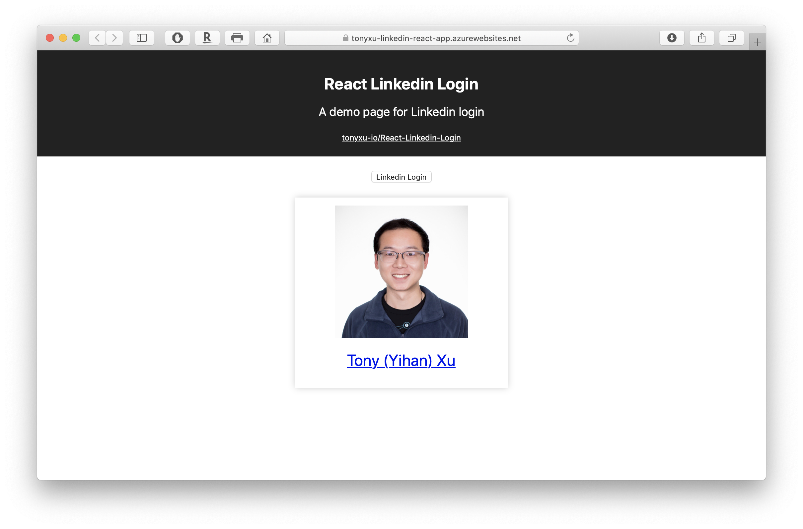

# React Linkedin Login

A simple app to demo Linkedin login using LinkedIn OAuth 2.0

## Screenshot



## Demo

http://linkedin-login-react.herokuapp.com (Please be prepared to wait for 30 seconds to load as Heroku freezes inactive app)

## Usage

### Clone

```shell
git clone https://github.com/tonyxu-io/React-Linkedin-Login.git
```

### Install Dependencies

Intall dependencies for server

```shell
cd React-Linkedin-Login
npm install
```

Install dependencies for client

```shell
cd client
npm install
```

### Get Linkedin App Credential from Linkedin Developer Portal

- client_id
- client_secret

Configure 'http://localhost:3001/callback' as Oauth2.0 redirect uri

### Create Environment Variables

/React-Linkedin-Login/.env

```shell
EXPRESS_APP_CLIENT_ID=${Your-Client-ID}
EXPRESS_APP_CLIENT_SECRET=${Your-Client-Secret}
EXPRESS_APP_REDIRECT_URI=http://localhost:3001/callback
```

/React-Linkedin-Login/client/.env

```shell
REACT_APP_CLIENT_ID=${Your-Client-ID}
REACT_APP_REDIRECT_URI=http://localhost:3001/callback
```

### Build Client

/React-Linkedin-Login/client:

```shell
yarn run build
```

### Start Server

/React-Linkedin-Login/:

```shell
npm start
```

## Consumed SDK/API

- [Linkedin OAuth 2.0 (3-Legged)](https://docs.microsoft.com/en-us/linkedin/shared/authentication/authorization-code-flow?context=linkedin/consumer/context)
- [Sign In with LinkedIn](https://docs.microsoft.com/en-us/linkedin/consumer/integrations/self-serve/sign-in-with-linkedin?context=linkedin/consumer/context)

## Changelog

- Jan 20, 2019: Migrated JS SDK related API usage (due to [deprecation of LinkedIn JS SDK](https://engineering.linkedin.com/blog/2018/12/developer-program-updates)) to REST API
- Aug 1, 2018: Removed summary check in case user doesn't have summary content
- April 2, 2018: Created first version using JS SDK to load profile